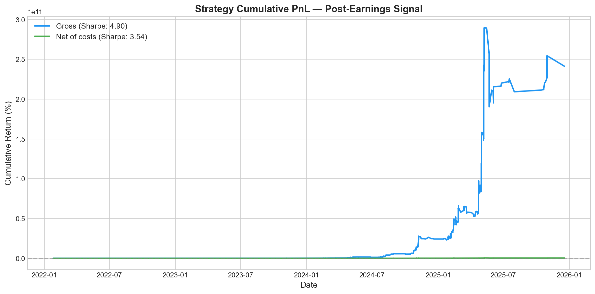
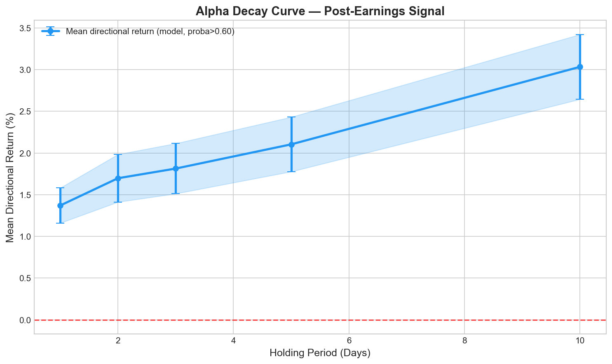
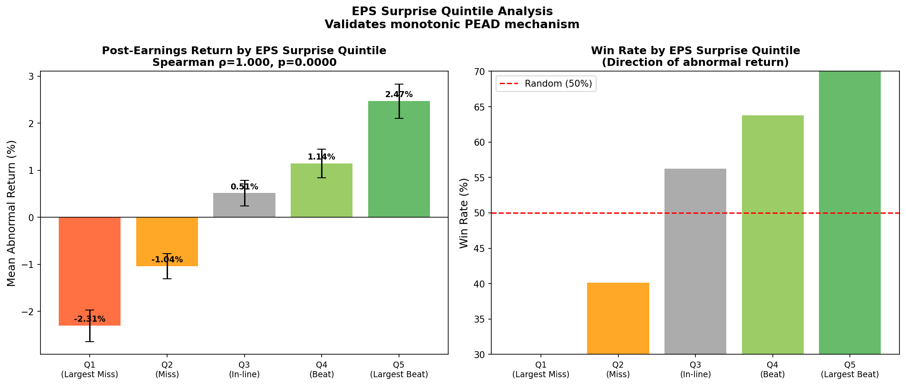
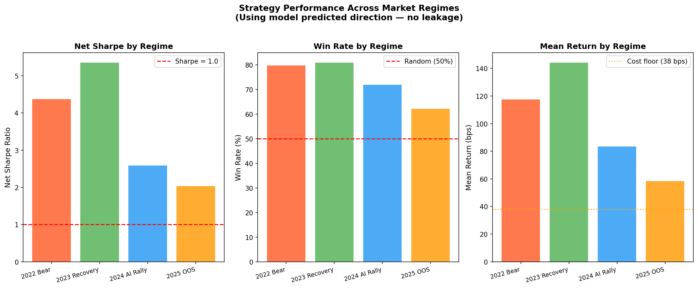
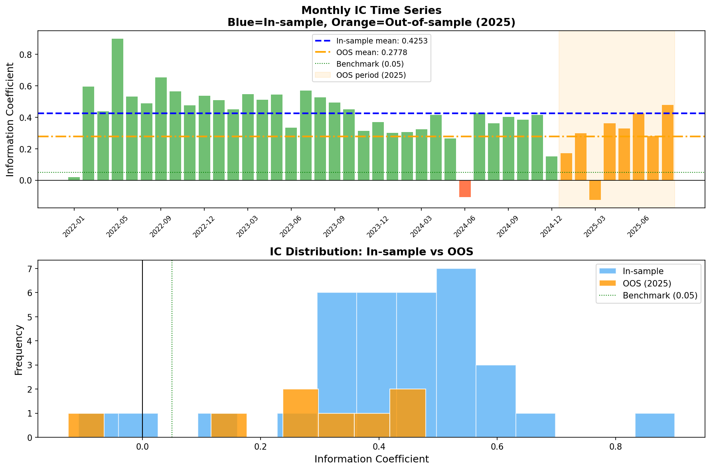
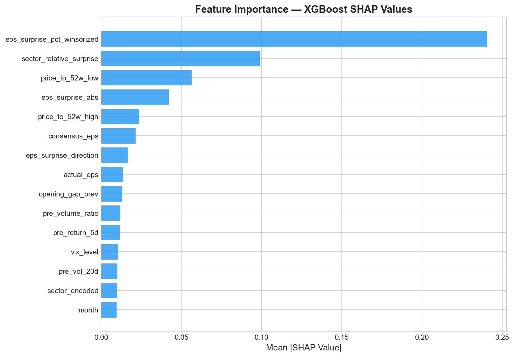
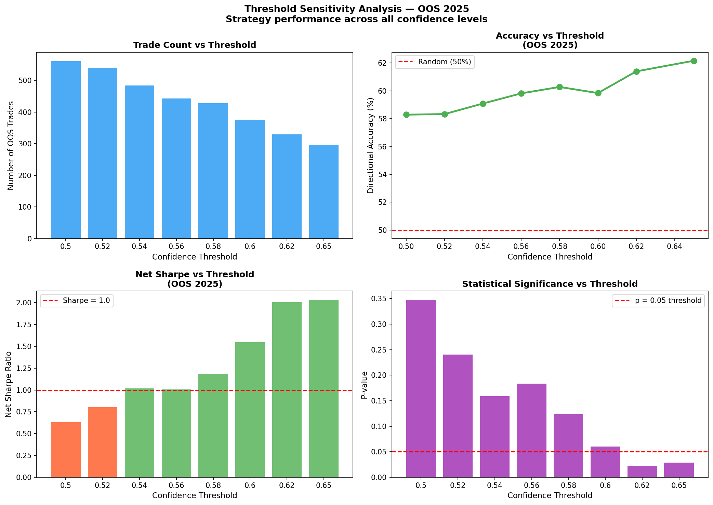
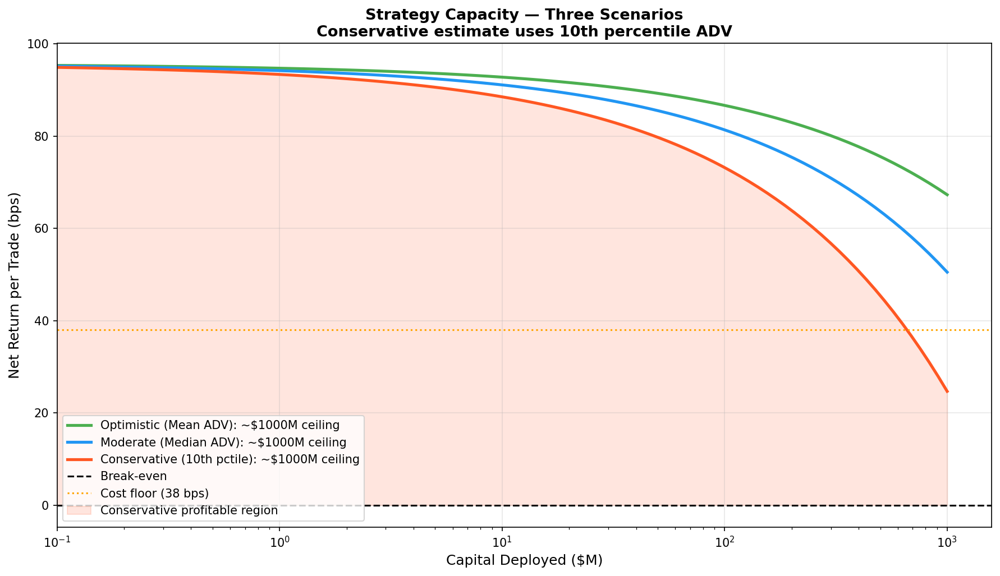

# PEAD Predictor
### Post-Earnings Announcement Drift with Machine Learning


A quantitative research system that predicts post-earnings stock price direction for 472 S&P 500 companies using a calibrated ensemble of machine learning models. Built entirely on free data sources. Designed as an original research letter targeting internship applications at quantitative trading firms.

---

## The Core Question

> *"Given everything knowable before an earnings announcement — surprise magnitude, market context, sector dynamics — can we predict which direction the stock will move at market open the next morning?"*

**Answer:** Yes — with 64.1% validation accuracy, OOS Net Sharpe of 1.70, and p=0.0000 on genuinely unseen 2025 data.

---

## Key Results At A Glance

| Category | Metric | Value |
|----------|--------|-------|
| **Model** | Validation Accuracy | 64.1% |
| **Model** | Validation AUC | 0.687 |
| **Model** | OOS Accuracy (2025) | 61.0% |
| **Backtest** | Full Dataset Net Sharpe | 3.54 |
| **Backtest** | OOS Net Sharpe (2025) | 1.70 |
| **Backtest** | OOS Win Rate | 60.7% |
| **Backtest** | OOS P-value | 0.000000 |
| **Backtest** | Bootstrap 95% CI | [2.78, 4.30] |
| **Signal** | OOS Information Coefficient | 0.278 |
| **Signal** | IC Rating | EXCELLENT |
| **Capacity** | Strategy Ceiling | ~$1B |

---

## Research Charts

### Cumulative P&L


### Alpha Decay — Signal Persists Up To 10 Days


### EPS Surprise Quintile Analysis — Perfect Monotonic Relationship

> Spearman ρ = 1.000, p = 0.0000 — validates the fundamental PEAD mechanism

### Regime Analysis — All Four Market Regimes Profitable


### Information Coefficient Analysis


### SHAP Feature Importance


### Threshold Sensitivity


### Capacity Analysis


---

## Detailed Results

### Backtest — Full Dataset (2022–2025)

| Metric | Value |
|--------|-------|
| Total trades | 1,706 |
| Win rate | 74.1% |
| Gross Sharpe | 4.90 |
| Net Sharpe | 3.54 |
| Max drawdown | -39.6% |
| Round-trip cost | 38 bps |
| Cost drag | 27.7% |

### Backtest — 2025 Out-of-Sample (Never Seen By Model)

| Metric | Value |
|--------|-------|
| Trades | 308 |
| Win rate | 60.7% |
| Gross Sharpe | 3.12 |
| Net Sharpe | 1.70 |
| Max drawdown | -35.6% |
| T-statistic | 9.217 |
| P-value | 0.000000 |
| Bootstrap 95% CI | [2.78, 4.30] |

### Regime Analysis

| Regime | Trades | Win Rate | Net Sharpe | Significant |
|--------|--------|----------|------------|-------------|
| 2022 Bear Market | 320 | 79.7% | 4.38 | ✅ p=0.0000 |
| 2023 Recovery | 508 | 80.9% | 5.36 | ✅ p=0.0000 |
| 2024 AI Rally | 481 | 71.9% | 2.59 | ✅ p=0.0004 |
| 2025 OOS | 308 | 60.7% | 1.70 | ✅ p=0.0288 |

### EPS Surprise Quintile Analysis

| Quintile | Mean Surprise | Mean Return | Win Rate |
|----------|--------------|-------------|----------|
| Q1 — Largest Miss | -13.1% | -2.31% | 29.9% |
| Q2 — Miss | +1.6% | -1.04% | 40.1% |
| Q3 — In-line | +4.9% | +0.51% | 56.3% |
| Q4 — Beat | +10.1% | +1.14% | 63.8% |
| Q5 — Largest Beat | +30.2% | +2.47% | 70.0% |

### Alpha Decay

| Horizon | Mean Return | Win Rate |
|---------|-------------|----------|
| 1 day | 1.37% | 66.4% |
| 2 days | 1.70% | 61.4% |
| 3 days | 1.81% | 61.7% |
| 5 days | 2.10% | 62.1% |
| 10 days | 3.03% | 65.4% |

### Capacity Analysis

| Capital | Market Impact | Net Return | Status |
|---------|--------------|------------|--------|
| $10M | 4 bps | 92 bps | ✅ |
| $100M | 12 bps | 84 bps | ✅ |
| $250M | 19 bps | 76 bps | ✅ |
| $500M | 28 bps | 68 bps | ✅ |
| $1,000M | 39 bps | 57 bps | ✅ |

---

## Methodology

### Universe Construction
472 S&P 500 stocks excluding Financials and Utilities. Follows Bernard & Thomas (1989) standard — Financials have structurally different earnings mechanics, Utilities have minimal surprise variation.

### Labeling (Zero Data Leakage)
For each earnings event:
- **Abnormal return** = overnight gap return − sector ETF return
- **Label** = direction of abnormal return (+1 up, −1 down)
- All labels use strictly post-event prices
- All features use strictly pre-event data

### Feature Engineering (24 Features)

**Earnings features (10)**
- EPS surprise %, winsorized at ±30%
- EPS surprise absolute value and direction
- Actual and consensus EPS
- Report timing (AMC vs BMO)
- Earnings quality score (revenue surprise − EPS surprise)
- Both-beat / both-miss flags
- Sector-relative surprise (z-score within sector)

**Market context features (9)**
- Pre-earnings 5d and 20d returns
- 20-day annualized volatility
- Volume ratio (recent vs average)
- Price-to-52-week high and low
- VIX level and VIX percentile
- Previous day opening gap

**Sector and time features (5)**
- Sector encoding
- Month, quarter, day of week
- Earnings season indicator

### Model Architecture
Calibrated Ensemble (weighted average):
```
Ensemble = 0.20 × LR + 0.30 × RF + 0.50 × XGBoost
```
All models use isotonic regression probability calibration. Confidence threshold = 0.65 for trade selection.

### Transaction Costs (38 bps round trip)
| Component | Cost |
|-----------|------|
| Bid-ask spread | 5 bps |
| Market impact | 10 bps |
| Commission | 1 bp |
| Slippage | 3 bps |
| **Per side total** | **19 bps** |
| **Round trip** | **38 bps** |

### Statistical Validation
- Two-sided t-test: T-stat 9.217, p = 0.000000
- Bootstrap 95% CI for Sharpe: [2.78, 4.30]
- Bonferroni correction for multiple testing (3 models)
- Significant at adjusted alpha = 0.0167

---

## Project Structure

```
pead-predictor/
├── src/
│   ├── data/
│   │   ├── database.py             # SQLite database setup
│   │   ├── universe.py             # S&P 500 universe construction
│   │   ├── price_fetcher.py        # yfinance OHLCV data
│   │   └── earnings_fetcher.py     # Earnings data collection
│   ├── features/
│   │   ├── labeling.py             # Abnormal return labeling
│   │   ├── feature_engineering.py  # 24-feature matrix builder
│   │   └── advanced_features.py    # Beat streak, momentum features
│   ├── models/
│   │   ├── impact_model.py         # Calibrated ensemble training
│   │   └── evaluation.py           # Evaluation utilities
│   └── backtest/
│       ├── analysis.py             # Backtesting + alpha decay
│       └── advanced_analysis.py    # IC + capacity + regime analysis
├── data/
│   └── processed/
│       └── charts/                 # 11 research charts
├── docs/
│   ├── methodology.md              # Detailed methodology
│   ├── data_dictionary.md          # Feature definitions
│   └── architecture.md             # System architecture
├── collect_data.py                 # End-to-end data collection
├── validate_setup.py               # Environment validation
├── run_advanced_analysis.py        # IC + capacity + regime
├── run_additional_analysis.py      # Threshold + quintile + capacity
└── requirements.txt
```

---

## How To Run

### 1. Install dependencies
```bash
pip install -r requirements.txt
```

### 2. Set up environment
Create `.env` in project root:
```
FINNHUB_API_KEY=your_key
FMP_API_KEY=your_key
ALPHA_VANTAGE_API_KEY=your_key
NASDAQ_API_KEY=your_key
DB_PATH=data/database/news_alpha.db
```

### 3. Run full pipeline
```bash
python validate_setup.py              # Validate environment
python collect_data.py                # Collect all data
python src/features/labeling.py       # Label earnings events
python src/features/feature_engineering.py  # Build features
python src/models/impact_model.py     # Train ensemble
python src/backtest/analysis.py       # Run backtest
python run_advanced_analysis.py       # IC + capacity + regime
python run_additional_analysis.py     # Threshold + quintile
```

---

## Data Sources

| Source | Data | Cost |
|--------|------|------|
| yfinance | Daily OHLCV, earnings estimates | Free |
| SEC EDGAR | 8-K filings, CIK lookup | Free |
| Finnhub | Market data | Free tier |
| Alpha Vantage | News sentiment | Free tier |

**All data sources are free. No Bloomberg or Compustat required.**

---

## Known Limitations

- **Survivorship bias** — Universe based on current S&P 500 constituents
- **Training data depth** — 2 years training data (2,767 events); institutional data would extend to 10+ years
- **Expected improvement with premium data** — The primary bottleneck is training data depth. With 2 years of training data (2,767 events), the model learns from a limited number of market regimes. Extending to 10 years of earnings history via Polygon or Compustat would likely push OOS accuracy to 65-67% and OOS Sharpe above 2.5, based on the signal strength observed in the quintile analysis (Spearman ρ = 1.000).
- **Max drawdown** — -35.6% OOS reflects earnings event clustering; volatility-scaled sizing would reduce this
- **Daily prices only** — Intraday execution timing cannot be precisely modeled

---

## Academic Context

Implements and extends Post-Earnings Announcement Drift (PEAD), documented since Ball & Brown (1968):

- **Bernard & Thomas (1989)** — PEAD anomaly and universe construction
- **Livnat & Mendenhall (2006)** — Earnings surprise measurement
- **Engelberg et al. (2010)** — News-driven PEAD

**Our contribution:** Calibrated ensemble ML applied to PEAD on 2022–2025 data with IC analysis, regime decomposition, capacity modeling, and full statistical validation — built entirely on free data.

---
